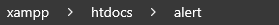

# BreakingNewsWoW

Alright, we have all seen some of the more up to date wow servers with custom breaking news. This may not be new some people but I have been away for a bit and just came back to learn and research about game clients. If you know anything about me then you're aware that I believe in sharing with everyone. That's how we advance and innovate. If you're going to use this and make any astonishing finds, I ask that you please share with everyone.

## How does this work?

This is a great question. So the client actually listens to a few different API calls. Depending on your region and your client's region will determine which api you want to target, and if you plan on having others connect with different client regions it would be a good idea to go ahead and have both supplied files from the "USE_THESE" directory.

One important thing to note, is that you should NOT change the paths of these files. Keep them as is or else it might not work, you're free to experiment and I actually encourage you to do so. I don't know everything there is to know about this. I'm just simply sharing what I know so far.

## Set up

To get this up and running, you will need to do the following.

### Server Setup (Windows)

1. Go to your webhost folder, most people use XAMPP and I would speculate that it does not matter so long as you place the correct files.
2. In htdocs(for xampp) and elsewhere for other hosting solutions you're going to place the en/alert/index.php AND the alert/index.php
   -- The file path will look like this:  for the US and like this  for EU
3. Drop the index.php in the directory, that's it. You should even be able to just take the en and alert folders and drop them into your hosting folder.

### Client Setup (Windows)

1. We're going to go into "C:\Windows\System32\drivers\etc"
2. Inside of this directory we're going to open "hosts" in order to make changes you will need to open as an administrator.

Here is the information you will need to append to the END of your hosts file.

```
# US WoW Redirect
127.0.0.1 launcher.worldofwarcraft.com
# EU WoW Redirect
127.0.0.1 status.wow-europe.com
```

3. Save the file and you're done. You should be able to launch the game and see the breaking news. If you don't see it, make sure your apache is running.

## Extra Information

This is a starting point. This has the potential to dynamically display information about your server or anything you want. Setup a mysqli connection and let your imagination run wild. I am not going to support any request for custom additions or scripts or anything. My main objective was to share this with everyone so that we can further explore and find more cool stuff. If you choose to publicly host this, you are taking on any and all liability. This is simply for educational value and the research of game clients.

## Credits to Original Poster

[coolzoom](https://gist.github.com/coolzoom) - This is where I found this information and made some changes to. We don't need a database connection for static information; however, you can implement and I have helped you get started with a .ini file.
